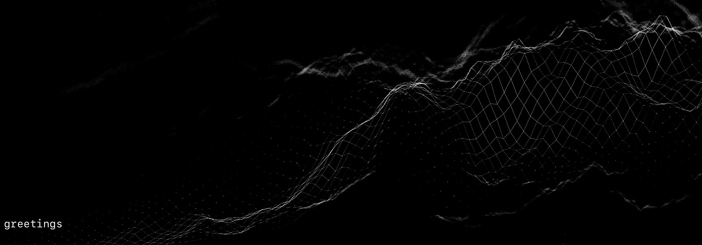

<!-- ### banner -->

<table align="center" border="0" cellspacing="0" cellpadding="0">
  <tr>
    <td colspan="10">
      <a href="https://wallpaperaccess.com/black-digital"> 
        
      <a>
    </td>
  </tr>
  <tr>
    <td align="center">
      
    </td>
    <td align="center">
      
    </td>
    <td align="center">
      
    </td>
    <td align="center">
      
    </td>
    <td align="center">
      
    </td>
    <td align="center">
      
    </td>
    <td align="center">
      
    </td>
    <td align="center">
      
    </td>
    <td align="center">
      
    </td>
    <td align="center">
      
    </td>
  </tr>
</table>
  
<!-- ### statistics -->

<h3>

  
statistics
 

<table border="0" cellspacing="0" cellpadding="0">
  <tr>
    <td>
      &nbsp;
    </td>
    <td align="center">&nbsp;
      
    </td>
    <td  align="right" style="color: lightgray; display: inline-block; justify-content: right; padding-top: 90px;"> 
      
    </td>
  </tr>
</table>

</h3>
  
   
  
<!-- ### pinned repositories -->
  
<h3>

pinned repositories

 

<table border="0" cellspacing="0" cellpadding="0">
  <tr>
    <td>
      
    </td>
    <td>
      
    </td>
    <td>
      
    </td>
    <td>
      
    </td>
  </tr>
</table>

</h3>

<!-- ### profile -->

<h3>

profile
 

</h3>
  
   

&nbsp;<b><strong>builder</strong></b>&nbsp;&nbsp;   
data scientist&nbsp;&nbsp;analyst&nbsp;&nbsp;music theorist&nbsp;&nbsp;composer&nbsp;&nbsp;   
trying to comprehend the veracity of forms casting shadows on my cave wall&nbsp;&nbsp;   
&nbsp;&nbsp;&nbsp;&nbsp;&nbsp;enjoys imbalanced yet meticulous design, cognitive science, physics   
 &nbsp;   
 &nbsp;   
 &nbsp;   
 &nbsp;&nbsp;&nbsp;&nbsp;currently occupied as a knight errant on some data developer's quest&nbsp;&nbsp;&nbsp;&nbsp;&nbsp;&nbsp;&nbsp;&nbsp;   
 &nbsp;   
 &nbsp;   
 &nbsp;<code>Query Editor</code>   
 &nbsp;   
 and unixtimestamp(731660399)") &nbsp;<code>SELECT aptitudes, accoutrements FROM people WHERE mind LIKE 'ocean' AND activity = 'hanging' AND location = 'harbor' AND name = '&#9001; me &#x3009;'</code>   
   
&nbsp;&nbsp;&nbsp;&nbsp;&nbsp;&nbsp;<code>Data Output</code>   

<!-- ### skills -->

<h4>

&nbsp;&nbsp;&nbsp;&nbsp;aptitudes

</h4>

<!-- python -->

&nbsp;&nbsp;
&nbsp;&nbsp;python

<a>[&nbsp;&nbsp;&nbsp;&nbsp;
&nbsp;&nbsp;beautifulsoup&nbsp;&nbsp;&nbsp;&nbsp;&nbsp;&nbsp;flask&nbsp;&nbsp;&nbsp;&nbsp;&nbsp;&nbsp;jinja&nbsp;&nbsp;&nbsp;&nbsp;
&nbsp;&nbsp;keras&nbsp;&nbsp;&nbsp;&nbsp;&nbsp;&nbsp;matplotlib&nbsp;&nbsp;&nbsp;&nbsp;&nbsp;&nbsp;numpy&nbsp;&nbsp;&nbsp;&nbsp;&nbsp;&nbsp;pandas&nbsp;&nbsp;&nbsp;&nbsp;&nbsp;&nbsp;requests&nbsp;&nbsp;&nbsp;&nbsp;&nbsp;&nbsp;tensorflow&nbsp;&nbsp;&nbsp;&nbsp;&nbsp;&nbsp;]</a>

<!-- js, html(xml), css -->

&nbsp;&nbsp;
&nbsp;&nbsp;javascript&nbsp;&nbsp;&nbsp;&nbsp;html&nbsp;&nbsp;&nbsp;&nbsp;css

<a>[&nbsp;&nbsp;&nbsp;&nbsp;
&nbsp;&nbsp;d3&nbsp;&nbsp;&nbsp;&nbsp;&nbsp;&nbsp;leaflet&nbsp;&nbsp;&nbsp;&nbsp;&nbsp;&nbsp;&nbsp;plotly&nbsp;&nbsp;&nbsp;&nbsp;&nbsp;&nbsp;][&nbsp;&nbsp;
&nbsp;&nbsp;html&nbsp;&nbsp;&nbsp;&nbsp;
&nbsp;&nbsp;[&nbsp;&nbsp;&nbsp;&nbsp;
&nbsp;&nbsp;xml&nbsp;&nbsp;&nbsp;&nbsp;
&nbsp;&nbsp;]&nbsp;&nbsp;&nbsp;&nbsp;&nbsp;&nbsp;][&nbsp;&nbsp;&nbsp;&nbsp;
&nbsp;&nbsp;bootstrap&nbsp;&nbsp;&nbsp;&nbsp;&nbsp;&nbsp;]</a>

<!-- databases -->

&nbsp;&nbsp;
&nbsp;&nbsp;sql&nbsp;&nbsp;&nbsp;&nbsp;mongodb

<a>[&nbsp;&nbsp;&nbsp;&nbsp;
&nbsp;&nbsp;postgres&nbsp;&nbsp;&nbsp;&nbsp;&nbsp;&nbsp;psycopg&nbsp;&nbsp;&nbsp;&nbsp;&nbsp;&nbsp;sqlalchemy&nbsp;&nbsp;&nbsp;&nbsp;&nbsp;&nbsp;sqlite&nbsp;&nbsp;&nbsp;&nbsp;&nbsp;&nbsp;][&nbsp;&nbsp;&nbsp;&nbsp;
&nbsp;&nbsp;pymongo&nbsp;&nbsp;&nbsp;&nbsp;&nbsp;&nbsp;]</a>

<!-- visual basic for applications -->

&nbsp;&nbsp;
  &nbsp;&nbsp;vba

<a>[&nbsp;&nbsp;&nbsp;&nbsp;
&nbsp;&nbsp;excel&nbsp;&nbsp;&nbsp;&nbsp;&nbsp;&nbsp;]</a>

<!-- r -->

&nbsp;&nbsp;
&nbsp;&nbsp;r

<!-- ### tools -->

<h4>

&nbsp;&nbsp;&nbsp;accoutrements

</h4>

&nbsp;&nbsp;tableau 
&nbsp;&nbsp;heroku 
&nbsp;&nbsp;git 
&nbsp;&nbsp;shell

<!-- ### auto-refreshed anecdotes -->

<h4>

&nbsp;&nbsp;&nbsp;anecdotes
 

last updated at 05:03:22 on 16 June 2022 (UTC) and again in an hour hence with data from the <i><a href="https://nuforc-sightings-database-api.herokuapp.com/">nuforc-sightings-database-api</a></i> 

 On this day in 2010, an anonymous witness in Cape May Courthouse (NJ) reported seeing craft that fit the description of some 'Disk' over a period of approximately several seconds - several seconds minutes.<blockquote>dimly lit disc shaped object flying east to west makes a hard 70degree turn at unimaginable speedFirst let me begin by saying that what I saw last night is just one more in a long list of extraordinary flying objects I’ve witnessed in the skies above where I live and where I work.  Last year I reported a sighting that three of my friends and I saw to Mufon.   However we were not taken seriously. I am aware that the Morristown Hoax has done a great deal to diminish credibility for all future UFO sightings in NJ, but I am not talking about seeing flares here.  I am a writer/researcher and one thing I discovered is that when our government wants to discredit a ufologist, they often create a hoax designed to lure UFO investigators into proclaiming the event is a genuinely unexplainable occurrence; only to have the rug pulled out from under them when the sighting is revealed as fake.  Morristown ruined the UFO hunters (on the History Channel) because the UFO hunter team went on national TV claiming that the sighting is undoubtedly real.  As soon as they did this, the sighting was proved to be hoaxed and the UFO hunters got canceled.  I feel I have to include this in my report because I think it is a big part of why no one seems to take me seriously.  Ok, on to what I saw last night. I am constantly sky-watching because I see so many unusual things up there.  I walked out my front door and looked up in the sky-facing east.  The first thing that caught my attention was a very quiet object with red strobe-lights.  I followed that for a second or two until a very dimly lit object flying west to east appeared in my line of sight.  This objec was shaped like a disc with two small wing-like appendages similar to the alien craft in the movie Independence Day.  The object was moving at an astronomical speed; faster than anything I’ve ever seen.  It flew straight over my head, kept on its course for about 2 or 3 seconds and then pulled a hard 70 degree left turn, and began heading North at that point. There is a house to the east of my house only 20 feet away, so t! o follow the object I had to rush toward the end of the drivew! ay to tr y and get a better look.  Unfortunately by then the object was gone. The night before last, I saw a very similar craft, also dimly lit and flying at break-neck speed in the same general direction.  I have witnessed tons of other amazing airborne activity, which if you are interested and willing to take me seriously, I will describe in detail.  Some of the most outrageous sightings happened when I was with friends or my co-worker in one case.  So I know that I am not crazy, even though I have been forced to question my sanity based on some of the things I’ve witnessed.  Also, I woke up a few weeks ago with a circular crater-like scar on my upper left thigh.  I don’t know how it got there, but I can see that there is something hard under the skin, and extending from the center I can see what looks like spokes on a bicycle wheel. I did some research to see if others have reported the same thing, and I must say I am a little bit frightened by what I found.  I have no memory of how I go! t this scar, but I do know that one night it wasn’t there and the next morning it was.  I really hope I’m not wasting my time filing this report.  I just want some answers.  I am aware that most people go their entire lives and never see a single thing that could be classified as a UFO, and yet in the last year alone, I’ve witnessed dozens.  Thank you for your time.</blockquote><i>source: [http://www.nuforc.org/webreports/reports/075/S75819.html](http://www.nuforc.org/webreports/reports/075/S75819.html)</i> 
<h5>

&nbsp;&nbsp;&nbsp;aftermost anecdotes
 

five most recent sightings from this day in history 
  

<!-- BLOG-POST-LIST:START -->
- [316](http://www.nuforc.org/webreports/reports/163/S163968.html)
- [315](http://www.nuforc.org/webreports/reports/163/S163470.html)
- [314](http://www.nuforc.org/webreports/reports/163/S163955.html)
- [313](http://www.nuforc.org/webreports/reports/163/S163716.html)
- [312](http://www.nuforc.org/webreports/reports/163/S163996.html)
<!-- BLOG-POST-LIST:END -->
  

<i>source: <a href=https://nuforc-sightings-database-api.herokuapp.com/sightings/today/rss.xml>https://nuforc-sightings-database-api.herokuapp.com/sightings/today/rss.xml</a></i>

<h5>

