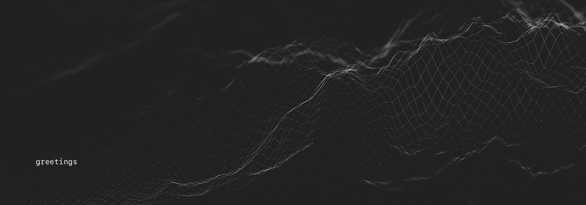
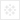
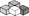

<table align="center" border="0" cellspacing="0" cellpadding="0">
<tr>
  <td colspan="10" border="0" cellspacing="0" cellpadding="0" ></td>
</tr>
<tr>
  <td align="center"></td>
  <td align="center"></td>
  <td align="center"></td>
  <td align="center"></td>
  <td align="center"></td>
  <td align="center"></td>
  <td align="center"></td>
  <td align="center"></td>
  <td align="center"></td>
  <td align="center"></td>
</tr>
</table>

[·](a "· this text")

[·](a "· this text")

<!--

**justineichelberger/justineichelberger** is a ✨ _special_ ✨ repository because its `README.md` (this file) appears on your GitHub profile.

Here are some ideas to get you started:

- 🔭 I’m currently working on ...
- 🌱 I’m currently learning ...
- 👯 I’m looking to collaborate on ...
- 🤔 I’m looking for help with ...
- 💬 Ask me about ...
- 📫 How to reach me: ...
- 😄 Pronouns: ...
- ⚡ Fun fact: ...

-->
